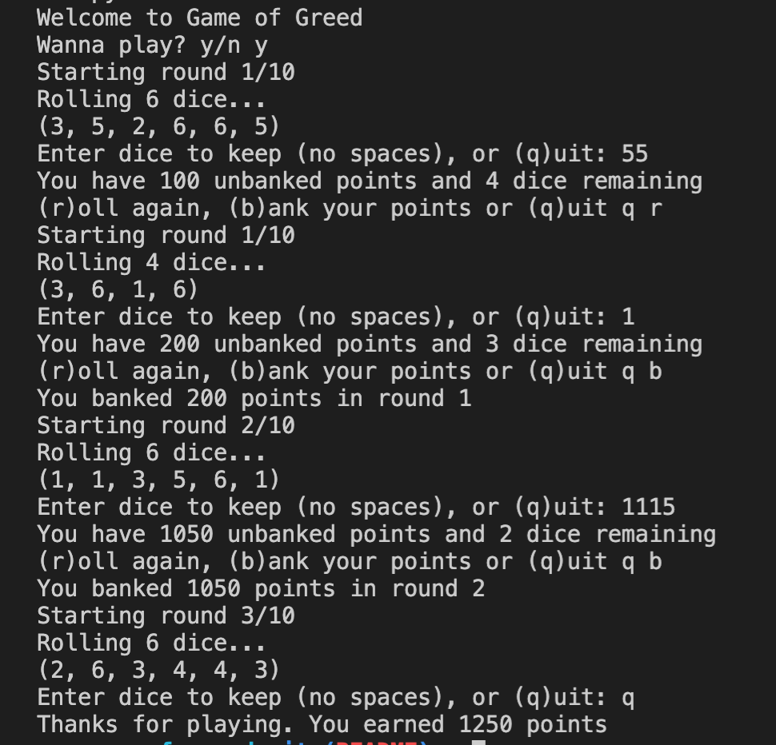

# Game of Greed

## Lab: 06, 07, 08, and 09

_Authors: Leo Kukharau, Natalie Sinner, Richard Whitehead_

---

## Description

This is a Python console application that will simulate a dice game called Game of Greed.

---

### Getting Started

Clone this repository to your local machine.

```
$ git clone [https://github.com/LeoKuhorev/game-of-greed.git]
```

### To run the program from VS Code:

Select `File` -> `Open` -> `Project/Solution`

Next navigate to the location you cloned the Repository.

Double click on the `game_of_greed` directory.

Then select and open `game_of_greed.py`

---

### Visuals

**_[Add screenshots of your application in action]_**

#### Application Start



#### Using the Application


#### Application End


---

### Change Log

1.0: _Initial setup_ - 16 Jun 2020  
1.1: _Initialized test GameLogic and Banker classes_ - 18 Jun 2020  
1.2: _Initialized user prompts and simulate dice rolling_ - 20 Jun 2020


[link to PR:](https://github.com/LeoKuhorev/game-of-greed/pull/6)