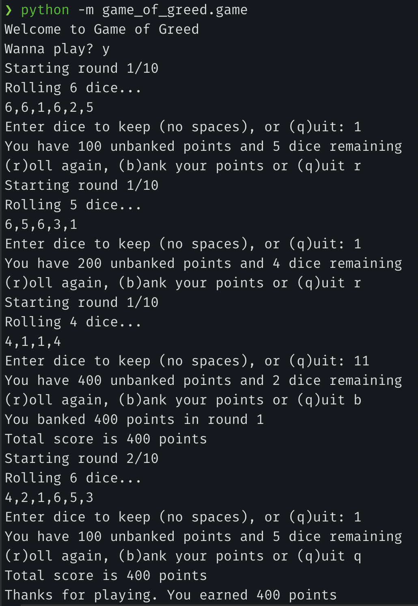

# Game of Greed

## Lab: 06, 07, 08, and 09

_Authors: Leo Kukharau, Natalie Sinner, Richard Whitehead_

---

## Description

This is a Python console application that simulates a dice game called Game of Greed. You can read the rules and more about this game [here](https://en.wikipedia.org/wiki/Dice_10000)

---

### Getting Started

Clone this repository to your local machine.

```
$ git clone [https://github.com/LeoKuhorev/game-of-greed.git]
```

### To run the program from VS Code:

Select `File` -> `Open` -> `Project/Solution`

Next navigate to the location you cloned the Repository.

Navigate to the `game_of_greed` directory.

Run `python -m game_of_greed.game` or `PYTHONPATH='.' python game_of_greed/game.py`

---

# Architecture

- Python 3.8.3
- Poetry
- Pytest

### Visuals

#### Application Start


#### Using the Application



---

### Change Log

1.0: _Initial setup_ - 16 Jun 2020  
1.1: _Initialized test GameLogic and Banker classes_ - 18 Jun 2020  
1.2: _Initialized user prompts and simulate dice rolling_ - 20 Jun 2020

[link to PR:](https://github.com/LeoKuhorev/game-of-greed/pull/16)
